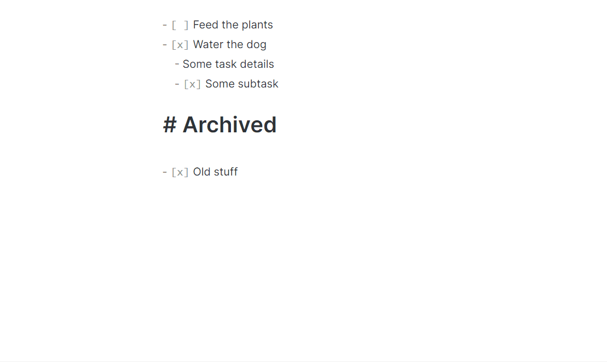

## Obsidian Task Archiver

This is a simple plugin that moves completed tasks in a file to the "Archived" heading.

Click to see a demo gif!

### Configuration

The plugin lets you configure the following:
- what text makes a heading an archive;
- whether completed tasks should be added under a link to the current week;
- the pattern of the weekly note link.

## Acknowledgements

This plugin is a simple & incomplete (for now) implementation of the archiving features of [org-mode](https://orgmode.org/).

Also, I relied on the code from these excellent plugins:
- [obsidian-kanban](https://github.com/mgmeyers/obsidian-kanban);
- [obsidian-outliner](https://github.com/vslinko/obsidian-outliner).
